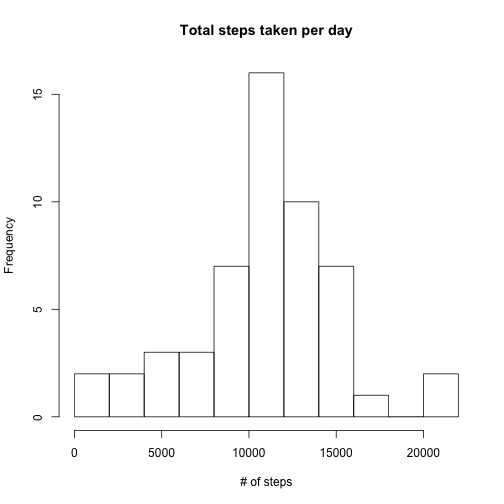
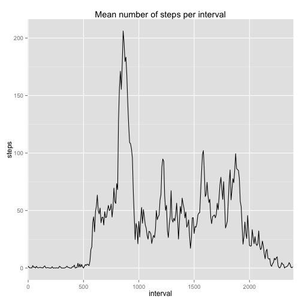
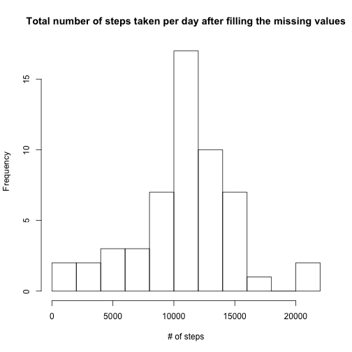
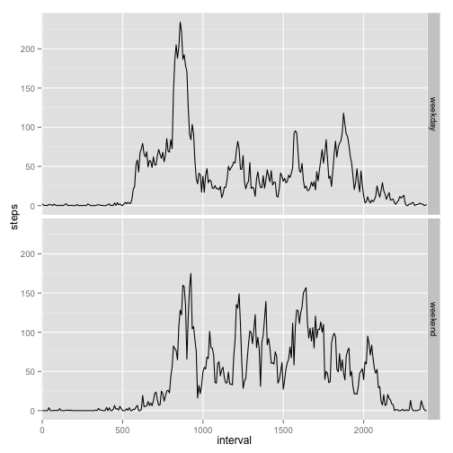

## Loading and preprocessing the data
For this analysis we will use the data from 'activity.csv' which can be downloaded [here](https://d396qusza40orc.cloudfront.net/repdata%2Fdata%2Factivity.zip). For loading the data into data frame we used this code:


```r
dat <- read.csv("activity.csv")
```

## What is mean total number of steps taken per day?
To calculate the mean total number of steps taken per day we used aggregate function. In this case, we ignored the NA values. The histogram of this variable can be seen below.

```r
total_steps <- aggregate(dat$steps~dat$date, FUN=sum, na.omit = TRUE)
names(total_steps) <- c("date", "steps")
hist(total_steps$steps, main = "Total steps taken per day", xlab = "# of steps", breaks = 10)
```

 

```r
m1 <- mean(total_steps$steps)
m2 <- median(total_steps$steps)
```
The median of total number of steps taken per day is 10766.00, while the mean is 10767.19.

## What is the average daily activity pattern?
To calculate the average number of steps per interval, we again used the aggregate function. The code for calcualtion and the time series can be found below. 


```r
mean_int = aggregate(dat$steps~dat$interval, FUN=mean, na.omit = TRUE)
names(mean_int) <- c("interval", "steps")
mean_int$interval <- as.factor(mean_int$interval)
library(ggplot2)
g <- qplot(interval, steps, data = mean_int, group = 1,geom = "line",
           main = "Mean number of steps per interval")
g + scale_x_discrete(breaks = c(0,500,1000,1500, 2000)) 
```

 

```r
max_int <- which(mean_int$steps==max(mean_int$steps))
max_steps <- mean_int$steps[104]
```
On average, considering all days in the data set, the most active interval of the day is interval 104 when 206.17 steps is taken in average.

## Imputing missing values
In order to fill in the fields with NA values, we made a new data.frame dat1 where we simply put the appropirate average values of the interval as shown in the code. 

```r
dat1 <- dat 
l <- length(dat1[is.na(dat1)])  
dat1$interval <- as.factor(dat1$interval)
mean_int$interval <- as.factor(mean_int$interval)
dat1$steps[is.na(dat1$steps)] <- mean_int$steps[mean_int$interval == dat1$interval]  
```

```
## Warning in dat1$steps[is.na(dat1$steps)] <-
## mean_int$steps[mean_int$interval == : number of items to replace is not a
## multiple of replacement length
```
The number of missing values was 2304. The new histogram after filling in the missing values is below.

```r
total_steps1 <- aggregate(dat1$steps~dat1$date, FUN=sum)
names(total_steps1) <- c("date", "steps")
hist(total_steps1$steps, main =
             "Total number of steps taken per day after filling the missing values",
     xlab = "# of steps", breaks = 10)
```

 

```r
m11 <- mean(total_steps1$steps)
m22 <- median(total_steps1$steps)
```
The new median is 10765.59, while the new mean is 10766.19. As we can see, adding the missing values affected the median, but not the mean - as expected.

## Are there differences in activity patterns between weekdays and weekends?
We would expect that people have different schedules during the weekdays and weekends. To check this, we created a new factor variable - weekday.

```r
dat1$date <- as.Date(dat1$date)
dat1$weekday <- weekdays(dat1$date, abbreviate = FALSE)
dat1$weekday[dat1$weekday == "Monday" | dat1$weekday == "Thursday"|
                     dat1$weekday == "Wednesday" | dat1$weekday == "Tuesday"|
                     dat1$weekday == "Friday"] <- "weekday"

dat1$weekday[dat1$weekday == "Saturday" | dat1$weekday == "Sunday"] <- "weekend"
dat1$weekday <- as.factor(dat1$weekday)
```
Again, using aggregate, we found average values for number of steps taken depending on the interval, and this time also depending on the weekday.
We used this data to create a time series plot so we can visualy explore the data. 

```r
mean_int1 = aggregate(dat$steps~dat$interval+dat1$weekday, FUN=mean, na.omit = TRUE)
names(mean_int1) = c("interval", "weekday", "steps")
mean_int1$interval <- as.factor(mean_int1$interval)
g1 <- qplot(interval, steps, data = mean_int1, facets = weekday~.,
            group = weekday, geom = "line")
g1 + scale_x_discrete(breaks = c(0,500,1000,1500, 2000))
```

 

As we can see above, there is a big difference in the middle intervals low number for weekdays, and higher for weekends.
